# Link Validation Strategy

This directory contains structured workflows for validating links in the AMPEL360-Q100 repository. The validation is partitioned by **time** (scheduled vs. PR-based) and by **link category** (relative, external, API endpoints, attachments).

## 🎯 Goals

1. **Maintain repository coherence** - Ensure all internal links remain valid as the structure evolves
2. **Detect external link degradation** - Catch broken external links over time
3. **Avoid unnecessary cost** - Only check what needs to be checked, when it needs checking
4. **Separate concerns** - Different link types require different validation approaches

## 📂 Workflow Files

### Active Workflows

| Workflow | File | Trigger | Purpose |
|----------|------|---------|---------|
| **Scheduled Full Validation** | `link-validation-scheduled.yml` | Weekly (Sunday 00:00 UTC) | Full repository scan for all markdown files |
| **PR Incremental Validation** | `link-validation-pr.yml` | Pull requests (changed `.md` files) | Validates only files modified in the PR |
| **API Endpoint Validation** | `api-validation.yml` | Daily (02:00 UTC) + PR changes | Validates API endpoint definitions |

### Deprecated Workflows

| Workflow | File | Status | Notes |
|----------|------|--------|-------|
| **Markdown Link Check** | `markdown-link-check.yml` | ⚠️ Deprecated | Being replaced by structured workflows above |

## 🔗 Link Categories

The validation strategy treats different link types differently:

### 1. Relative Links (Internal Repository Links)

**Examples:**
- `[See README](./README.md)`
- `[Problem Statement](../LC01_PROBLEM_STATEMENT/README.md)`
- `[Index](../../00_INDEX.md)`

**Validation:**
- ✅ **Always checked** when files containing them change (PR workflow)
- ✅ **Always checked** in scheduled full scans
- ❌ **Blocking** - PRs fail if relative links are broken
- 🎯 **Rationale:** Internal links must always work; broken internal links indicate structural issues

### 2. External Hyperlinks (HTTP/HTTPS)

**Examples:**
- `https://img.shields.io/badge/...`
- `https://github.com/AmedeoPelliccia/AMPEL360-Q100`
- `https://www.example.com/documentation`

**Validation:**
- ✅ **Checked** for files modified in PRs (PR workflow)
- ✅ **Checked** in scheduled full scans
- ⚠️ **Non-blocking** - PRs succeed even if external links are temporarily down
- 🎯 **Rationale:** External sites may be temporarily unavailable; shouldn't block development

**Excluded patterns:**
- `mailto:` links
- `tel:` links

### 3. API Endpoints

**Examples:**
- `GET /api/v1/terms`
- `POST /api/v1/terms`
- `GET /api/v1/export?format=json`

**Validation:**
- ✅ **Separate dedicated workflow** (`api-validation.yml`)
- ✅ **Validates against explicit endpoint definitions** (`.github/api-endpoints.json`)
- ✅ **Checks structure and documentation consistency**
- 🎯 **Rationale:** API endpoints require structured validation with expected responses, not just URL checking

**Configuration:**
- Endpoint definitions: `.github/api-endpoints.json`
- Documentation reference: `OPT-IN_FRAMEWORK/.../KNU-00-00-001-TEST-005_api-integration-tests.md`

### 4. Attachments & Binaries (Excluded)

**Examples:**
- ``
- `[Manual](./docs/manual.pdf)`
- `[Download](./releases/package.zip)`

**Validation:**
- ⏭️ **Explicitly excluded** from all link validation
- 🎯 **Rationale:** Binary files aren't suitable for URL validation; presence is verified through repository structure

**Excluded extensions:**
- Images: `.png`, `.jpg`, `.jpeg`, `.gif`, `.svg`, `.bmp`, `.webp`, `.ico`
- Documents: `.pdf`
- Archives: `.zip`, `.tar`, `.gz`, `.tgz`, `.bz2`, `.7z`, `.rar`
- Binaries: `.exe`, `.dll`, `.so`, `.dylib`, `.bin`

## 🔄 Validation Flow

### On Pull Request (Incremental)

```mermaid
graph TD
    A[PR with .md changes] --> B[Detect changed files]
    B --> C[Validate relative links]
    C --> D{Relative links OK?}
    D -->|No| E[❌ Fail PR]
    D -->|Yes| F[Validate external links]
    F --> G{External links OK?}
    G -->|No| H[⚠️ Warn but pass]
    G -->|Yes| I[✅ Pass PR]
    H --> I
```



### On Schedule (Full Scan)


### API Validation (Dedicated)


## ⚙️ Configuration Files

### `.github/markdown-link-check-config.json`

Main configuration for link checking:

```json
{
  "ignorePatterns": [
    {"pattern": "^mailto:"},
    {"pattern": "\\.pdf$"},
    {"pattern": "\\.(png|jpg|jpeg|gif|svg)$"}
  ],
  "timeout": "20s",
  "retryOn429": true,
  "retryCount": 3,
  "aliveStatusCodes": [200, 206, 301, 302, 307, 308, 403]
}
```

### `.github/api-endpoints.json`

API endpoint definitions:

```json
{
  "baseUrl": "https://api.ampel360.example.com",
  "endpoints": [
    {
      "name": "Get all terms",
      "method": "GET",
      "url": "/api/v1/terms",
      "expectedStatus": [200],
      "description": "Retrieve list of all terms"
    }
  ]
}
```

## 📊 Metrics & Reporting

Each workflow generates a summary report including:

### Scheduled Full Validation
- Total files checked
- Files with issues
- Relative link errors
- External link errors
- Timestamp and validation type

### PR Incremental Validation
- Changed files list
- Relative link status (pass/fail)
- External link status (warning/pass)
- Link category policy reminder

### API Validation
- Endpoint count by method
- Authentication requirements
- Validation status
- Documentation references

## 🚀 Usage

### Manual Workflow Triggers

All workflows support manual triggering via GitHub Actions UI:

1. Go to **Actions** tab
2. Select desired workflow
3. Click **Run workflow**
4. Select branch
5. Click **Run workflow** button

### Local Testing

To test link validation locally before pushing:

```bash
# Install markdown-link-check
npm install -g markdown-link-check

# Check a single file
markdown-link-check --config .github/markdown-link-check-config.json README.md

# Check all markdown files
find . -name "*.md" -not -path "*/node_modules/*" -exec markdown-link-check --config .github/markdown-link-check-config.json {} \;
```

## 🔧 Maintenance

### Adding New API Endpoints

1. Edit `.github/api-endpoints.json`
2. Add endpoint definition with all required fields:
   ```json
   {
     "name": "Endpoint name",
     "method": "GET|POST|PUT|DELETE",
     "url": "/api/v1/resource",
     "expectedStatus": [200],
     "requiresAuth": false,
     "description": "What this endpoint does"
   }
   ```
3. Commit and push - API validation workflow will run

### Updating Link Ignore Patterns

1. Edit `.github/markdown-link-check-config.json`
2. Add pattern to `ignorePatterns` array
3. Test locally
4. Commit and push

### Modifying Validation Frequency

Edit the `cron` schedule in the respective workflow:

- **Scheduled full validation:** `link-validation-scheduled.yml` (currently weekly)
- **API validation:** `api-validation.yml` (currently daily)

## 📝 Best Practices

1. **Relative links:** Always use relative paths from the current file location
2. **External links:** Verify before committing; use stable URLs when possible
3. **API endpoints:** Keep `.github/api-endpoints.json` in sync with actual API
4. **Documentation:** Update API test specs when endpoints change
5. **PR reviews:** Check link validation summary before approving PRs

## 🐛 Troubleshooting

### Relative link validation fails

**Symptom:** PR fails with relative link errors

**Solution:**
1. Check file paths are correct relative to the current file
2. Ensure target files exist in the repository
3. Verify case-sensitivity (especially on Linux/Unix)

### External link validation warns

**Symptom:** External links show warnings but PR passes

**Solution:**
1. Verify the URL is accessible from outside
2. Check for temporary outages (retry later)
3. Consider if the link is still relevant
4. Update or remove dead links

### API validation fails

**Symptom:** API validation workflow reports errors

**Solution:**
1. Validate JSON syntax in `.github/api-endpoints.json`
2. Ensure all required fields are present
3. Check that referenced documentation exists
4. Verify endpoint definitions match specifications

## 📚 References

- [markdown-link-check documentation](https://github.com/tcort/markdown-link-check)
- [GitHub Actions workflow syntax](https://docs.github.com/en/actions/reference/workflow-syntax-for-github-actions)
- [API Integration Test Specification](../OPT-IN_FRAMEWORK/O-ORGANIZATIONS/ATA_00-GENERAL/ATA-00-general/00-00-general/SSOT/LC06_VERIFICATION/KNU-00-00-001-TEST-005_api-integration-tests.md)

---

**Version:** 1.0  
**Last Updated:** 2026-01-13  
**Maintained by:** AMPEL360 Repository Team
